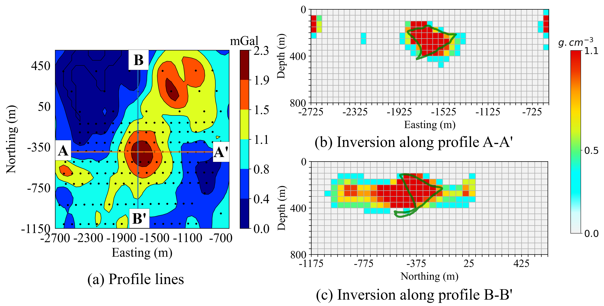

# GRAVIGNN: Gravity Data Inversion Using Graph Neural Network

GraviGNN is a graph based framework for **3D gravity inversion** experiments.  
This repository has codebase for end-to-end workflows: **training**, **evaluation**, **noise robustness**, **visualization**, and a **real field-case study** (San Nicolas VMS deposit, Mexico).

<p align="center">
  
</p>

## Overview

Given gravity anomaly observations (synthetic or real), GraviGNN learns to predict a **subsurface target representation** (e.g., density/ore body mask/voxelized anomaly-to-structure mapping).

The repo provides:
- ✅ Training notebooks for the core GraviGNN model
- ✅ Quantitative evaluation utilities (metrics + plots)
- ✅ Robustness studies under Gaussian noise
- ✅ A complete **field inversion** pipeline using San Nicolas data slices

## Key ideas

At a high level, GraviGNN uses:
- **CNN-style encoders/decoders** for grid-like gravity maps, and
- **graph-based feature mixing** using a *kNN graph* built from feature distances.

A central component is a **GraphConv** layer that:
1. Computes **k-nearest neighbors** using Euclidean distance
2. Aggregates neighbor features using **elementwise max**
3. Concatenates original + aggregated features
4. Applies **multi-head linear projections** (graph “attention-like” heads without explicit attention weights)

---
## Repository structure

| File / Notebook | Purpose |
|---|---|
| `GraviGNN_with_reg.ipynb` | Main model components + (regularized) training setup / architecture definitions |
| `GraviGNN_Noise.ipynb` | Training + evaluation under Gaussian noise (robustness study) |
| `GraviGNN_Evaluation.ipynb` | Computes metrics and quantitative evaluation summaries |
| `GraviGNN_Plots.ipynb` | Plotting + figure generation (paper-style visualizations) |
| `SanNicholas_Field Inversion_using_GraviGNN.ipynb` | Real-data inversion case study (San Nicolas VMS deposit) |
| `GraviGNN-Framework.png` | Framework diagram |
| `SanNicholasInversion (1).png` | Example field inversion figure/image |
| `requirements.txt` | Dependencies (pinned versions for reproducibility) |
---

------------------------------------------------------------------------

# 📦 Installation & Reproducibility

## 🔧 Steps to Reproduce Results

### 1. Clone the Repository

``` bash
git clone https://github.com/Gourab111186/GraviGNN.git
cd GraviGNN
```

------------------------------------------------------------------------

### 2. Create a Conda Environment

``` bash
conda create -n gravignn python=3.9 -y
conda activate gravignn
pip install -r requirements.txt
```

This installs all required dependencies for running GraviGNN.

------------------------------------------------------------------------

# 📊 San Nicolas Field Inversion Result

<p align="center">
  
</p>

## 🔍 Figure Description

The figure consists of three panels:

### (a) Profile Lines

-   Residual gravity anomaly map (mGal)\
-   Two cross-section lines: **A--A′** and **B--B′**

### (b) Inversion Along A--A′

-   Recovered density contrast section (g/cm³)\
-   Axes: **Depth vs Easting**

### (c) Inversion Along B--B′

-   Recovered density contrast section (g/cm³)\
-   Axes: **Depth vs Northing**

These results demonstrate the ability of GraviGNN to recover meaningful
subsurface density structures from real gravity measurements.

------------------------------------------------------------------------

# 🧠 Method Overview

GraviGNN formulates gravity inversion as a graph learning problem:

-   Nodes represent spatial grid locations
-   Edges encode spatial proximity (k-NN graph)
-   Node features correspond to gravity measurements
-   The GNN predicts subsurface density contrasts

This approach enables: - Scalability to large surveys\
- Robust spatial regularization\
- Efficient inference

------------------------------------------------------------------------

# 📁 Project Structure

    GraviGNN/
    │── data/
    │── models/
    │── utils/
    │── train.py
    │── inference.py
    │── requirements.txt
    │── README.md

------------------------------------------------------------------------

# 📚 Citation

``` bibtex
@misc{gravignn,
  title        = {GraviGNN: 3D Gravity Inversion with Graph Neural Networks},
  author       = {Gourab111186},
  howpublished = {GitHub repository},
  url          = {https://github.com/Gourab111186/GraviGNN}
}
```

------------------------------------------------------------------------

# ⭐ Acknowledgment

If you find this work useful, please consider giving the repository a
star.


