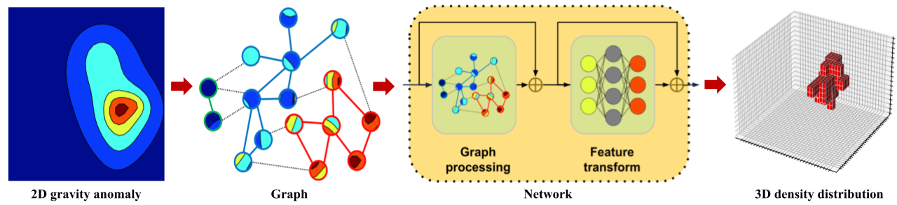

# GRAVIGNN: Gravity Data Inversion Using Graph Neural Network

GraviGNN is a graph based framework for **3D gravity inversion** experiments.  
This repository has codebase for end-to-end workflows: **training**, **evaluation**, **noise robustness**, **visualization**, and a **real field-case study** (San Nicolas VMS deposit, Mexico).

<p align="center">
  
</p>

---

## Table of Contents

- [What this repo does](#what-this-repo-does)
- [Key ideas](#key-ideas)
- [Repository structure](#repository-structure)
- [Installation](#installation)
- [Quickstart](#quickstart)
- [Notebooks walkthrough](#notebooks-walkthrough)
- [Data format](#data-format)
- [Model overview](#model-overview)
- [Training details](#training-details)
- [Evaluation](#evaluation)
- [Noise robustness](#noise-robustness)
- [Field case: San Nicolas inversion](#field-case-san-nicolas-inversion)
- [Reproducibility notes](#reproducibility-notes)
- [Troubleshooting](#troubleshooting)
- [Citation](#citation)
- [License](#license)
- [Contact](#contact)

---

## What this repo does

Given gravity anomaly observations (synthetic or real), GraviGNN learns to predict a **subsurface target representation** (e.g., density/ore body mask/voxelized anomaly-to-structure mapping depending on the notebook setup).

The repo provides:
- ✅ Training notebooks for the core GraviGNN model
- ✅ Quantitative evaluation utilities (metrics + plots)
- ✅ Robustness studies under Gaussian noise
- ✅ A complete **field inversion** pipeline using San Nicolas data slices

Here’s the **San Nicolas field inversion result image (the “second image” in the repo)** — the file **`SanNicholasInversion (1).png`**. 

**What you’re seeing in that figure:**

* **(a) Profile lines:** residual gravity map (mGal) with two cross-section lines **A–A′** and **B–B′**
* **(b) Inversion along A–A′:** recovered density contrast section (g/cm³) vs **Depth** and **Easting**
* **(c) Inversion along B–B′:** recovered density contrast section (g/cm³) vs **Depth** and **Northing** 


---

## Key ideas

At a high level, GraviGNN mixes:
- **CNN-style encoders/decoders** for grid-like gravity maps, and
- **graph-based feature mixing** using a *kNN graph* built from feature distances.

A central component is a **GraphConv** layer that:
1. Computes **k-nearest neighbors** using Euclidean distance (`torch.cdist`)
2. Aggregates neighbor features using **elementwise max**
3. Concatenates original + aggregated features
4. Applies **multi-head linear projections** (graph “attention-like” heads without explicit attention weights)

This is used inside a **ViGBlock** (Vision-Graph style block) and integrated into a **ViGUNet** (UNet-like architecture augmented with graph mixing).

---

## Repository structure

| File / Notebook | Purpose |
|---|---|
| `GraviGNN_with_reg.ipynb` | Main model components + (regularized) training setup / architecture definitions |
| `GraviGNN_Noise.ipynb` | Training + evaluation under Gaussian noise (robustness study) |
| `GraviGNN_Evaluation.ipynb` | Computes metrics and quantitative evaluation summaries |
| `GraviGNN_Plots.ipynb` | Plotting + figure generation (paper-style visualizations) |
| `SanNicholas_Field Inversion_using_GraviGNN.ipynb` | Real-data inversion case study (San Nicolas VMS deposit) |
| `GraviGNN-Framework.png` | Framework diagram |
| `SanNicholasInversion (1).png` | Example field inversion figure/image |
| `requirements.txt` | Dependencies (pinned versions for reproducibility) |

---

## Installation

### 1) Clone the repository
```bash
git clone https://github.com/Gourab111186/GraviGNN.git
cd GraviGNN


### 2) Create an environment

conda create -n gravignn python=3.9 -y
conda activate gravignn
pip install -r requirements.txt

## Citation
@misc{gravignn,
  title        = {GraviGNN: 3D Gravity Inversion with Graph Neural Networks},
  author       = {Gourab111186},
  howpublished = {GitHub repository},
  url          = {https://github.com/Gourab111186/GraviGNN}
}
